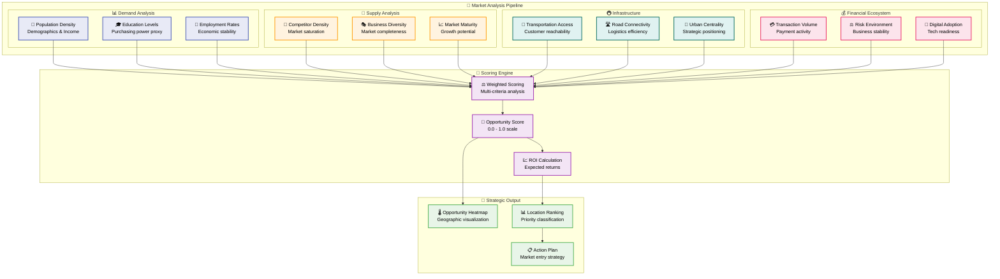
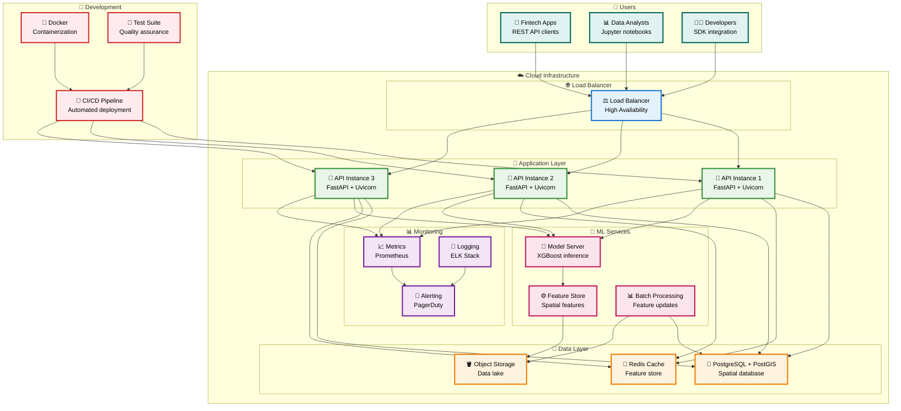

# 🎨 Technical Architecture Diagrams

## 💰 Credit Risk Intelligence Flow

Our spatial credit risk assessment process combines traditional financial metrics with advanced geographic intelligence:

```mermaid
flowchart LR
    subgraph "📍 Location Input"
        LOC["🌐 Geographic Point<br/>(Lat, Lon)"]
    end
    
    subgraph "🗺️ Spatial Processing"
        H3_CONV["⬡ H3 Conversion<br/>Point → Hexagon ID"]
        NEIGHBORS["🔗 Neighborhood Analysis<br/>K-ring spatial context"]
        FEATURES["⚙️ Feature Extraction<br/>50+ spatial indicators"]
    end
    
    subgraph "💼 Business Context"
        BUSINESS["🏢 Business Profile<br/>Type, Age, Revenue"]
        FINANCIAL["💰 Financial Data<br/>Credit history, Ratios"]
        COMBINED["🔄 Data Fusion<br/>Spatial + Business features"]
    end
    
    subgraph "🧠 AI Processing"
        MODEL["🤖 XGBoost Model<br/>Spatial intelligence"]
        SHAP["📊 SHAP Explainer<br/>Feature importance"]
        SCORE["🎯 Risk Score<br/>0-1000 scale"]
    end
    
    subgraph "📋 Decision Output"
        CATEGORY["🏷️ Risk Category<br/>Low/Medium/High/Critical"]
        RECOMMENDATION["💡 Decision<br/>Approve/Review/Decline"]
        FACTORS["🔍 Key Factors<br/>Spatial contributors"]
    end
    
    LOC --> H3_CONV
    H3_CONV --> NEIGHBORS
    NEIGHBORS --> FEATURES
    
    BUSINESS --> COMBINED
    FINANCIAL --> COMBINED
    FEATURES --> COMBINED
    
    COMBINED --> MODEL
    MODEL --> SHAP
    MODEL --> SCORE
    
    SCORE --> CATEGORY
    SHAP --> FACTORS
    CATEGORY --> RECOMMENDATION
    FACTORS --> RECOMMENDATION
    
    classDef input fill:#e3f2fd,stroke:#0277bd,stroke-width:3px,color:#000
    classDef spatial fill:#e8f5e8,stroke:#2e7d32,stroke-width:3px,color:#000
    classDef business fill:#fff8e1,stroke:#f57c00,stroke-width:3px,color:#000
    classDef ai fill:#fce4ec,stroke:#c2185b,stroke-width:3px,color:#000
    classDef output fill:#f1f8e9,stroke:#558b2f,stroke-width:3px,color:#000
    
    class LOC input
    class H3_CONV,NEIGHBORS,FEATURES spatial
    class BUSINESS,FINANCIAL,COMBINED business
    class MODEL,SHAP,SCORE ai
    class CATEGORY,RECOMMENDATION,FACTORS output
```

## 🏪 Market Intelligence Pipeline

Our market opportunity analysis leverages multi-dimensional spatial data to identify optimal expansion locations:

## 🗺️ Spatial Data Architecture

Built on Uber's H3 hexagonal grid system for consistent, efficient spatial analysis:

```mermaid
graph TB
    subgraph "🌍 Geographic Coverage"
        direction LR
        POA["🏙️ Porto Alegre<br/>Metropolitan Area"]
        BOUNDS["📐 Spatial Bounds<br/>1,000+ km²"]
    end
    
    subgraph "⬡ H3 Hexagonal Grid"
        direction TB
        RES9["🔍 Resolution 9<br/>~174m edge length"]
        HEXS["⬢ 1,000+ Hexagons<br/>Complete coverage"]
        INDEX["📇 Spatial Indexing<br/>Uber H3 system"]
    end
    
    subgraph "📊 Feature Categories"
        direction TB
        
        subgraph "👥 Socioeconomic"
            INCOME["💰 Average Income"]
            AGE["👶👨👴 Age Distribution"]
            EDUC["🎓 Education Levels"]
            UNEMP["📊 Unemployment Rate"]
        end
        
        subgraph "🏪 Commercial"
            POI_COUNT["🏢 POI Density"]
            MERCHANT["💳 Merchant Count"]
            DIVERSITY["🎭 Business Diversity"]
            COMPETITION["⚔️ Competition Level"]
        end
        
        subgraph "🚇 Infrastructure"
            ROADS["🛣️ Road Density"]
            TRANSPORT["🚌 Transit Access"]
            CENTRAL["🎯 Centrality Score"]
            CONNECT["🔗 Connectivity Index"]
        end
        
        subgraph "💎 Spatial Intelligence"
            NEIGHBORS["🔗 Neighborhood Effects"]
            CLUSTERS["🎯 Spatial Clusters"]
            HOTSPOTS["🔥 Business Hotspots"]
            ISOLATION["🏝️ Isolation Metrics"]
        end
    end
    
    subgraph "⚡ Real-time Processing"
        QUERY["❓ Location Query<br/>(lat, lon)"]
        LOOKUP["🔍 Hexagon Lookup<br/>O(1) complexity"]
        ENRICH["⚙️ Feature Enrichment<br/>Sub-second response"]
        RESULT["📊 Spatial Intelligence<br/>50+ features"]
    end
    
    POA --> RES9
    BOUNDS --> RES9
    RES9 --> HEXS
    HEXS --> INDEX
    
    INDEX --> INCOME
    INDEX --> AGE
    INDEX --> EDUC
    INDEX --> UNEMP
    
    INDEX --> POI_COUNT
    INDEX --> MERCHANT
    INDEX --> DIVERSITY
    INDEX --> COMPETITION
    
    INDEX --> ROADS
    INDEX --> TRANSPORT
    INDEX --> CENTRAL
    INDEX --> CONNECT
    
    INDEX --> NEIGHBORS
    INDEX --> CLUSTERS
    INDEX --> HOTSPOTS
    INDEX --> ISOLATION
    
    QUERY --> LOOKUP
    LOOKUP --> ENRICH
    ENRICH --> RESULT
    
    classDef geo fill:#e1f5fe,stroke:#01579b,stroke-width:3px,color:#000
    classDef h3 fill:#e8f5e8,stroke:#1b5e20,stroke-width:3px,color:#000
    classDef socio fill:#fff8e1,stroke:#f57c00,stroke-width:2px,color:#000
    classDef commercial fill:#fce4ec,stroke:#c2185b,stroke-width:2px,color:#000  
    classDef infra fill:#e0f2f1,stroke:#00695c,stroke-width:2px,color:#000
    classDef spatial fill:#f3e5f5,stroke:#7b1fa2,stroke-width:2px,color:#000
    classDef processing fill:#ffebee,stroke:#d32f2f,stroke-width:3px,color:#000
    
    class POA,BOUNDS geo
    class RES9,HEXS,INDEX h3
    class INCOME,AGE,EDUC,UNEMP socio
    class POI_COUNT,MERCHANT,DIVERSITY,COMPETITION commercial
    class ROADS,TRANSPORT,CENTRAL,CONNECT infra
    class NEIGHBORS,CLUSTERS,HOTSPOTS,ISOLATION spatial
    class QUERY,LOOKUP,ENRICH,RESULT processing
```

## ☁️ Production Deployment Architecture

Scalable cloud infrastructure for enterprise deployment:

